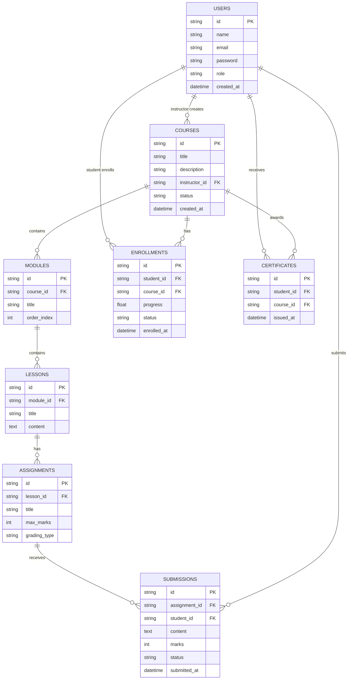

# ER Diagram — Learning Management System (LMS)

## Overview

This Entity-Relationship (ER) diagram represents the database schema for the Learning Management System (LMS).

It defines all primary entities, attributes, primary keys, foreign keys, and relationships between tables required to support:

- User management
- Course structure
- Enrollment workflow
- Assignment and grading
- Progress tracking
- Certificate generation

The schema is designed to maintain data integrity, scalability, and structured academic workflows.

---

## ER Diagram (Mermaid)

---

## Table Summary

| Table | Description | Key Relationships |
|-------|-------------|-------------------|
| `USERS` | All platform users (students, instructors, admins) | → Courses, Enrollments, Submissions, Certificates |
| `COURSES` | Course metadata and publishing status | ← User (instructor), → Modules, Enrollments, Certificates |
| `MODULES` | Logical content groupings within a course | ← Course, → Lessons |
| `LESSONS` | Individual content units within modules | ← Module, → Assignments |
| `ENROLLMENTS` | Student-course enrollment records with progress | ← User (student), ← Course |
| `ASSIGNMENTS` | Tasks assigned within lessons for evaluation | ← Lesson, → Submissions |
| `SUBMISSIONS` | Student assignment submissions with grades | ← Assignment, ← User (student) |
| `CERTIFICATES` | Completion certificates issued to students | ← User (student), ← Course |
