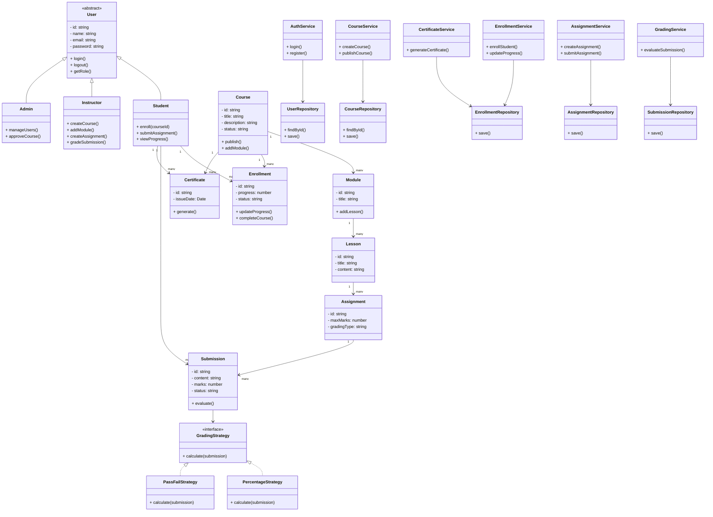

# Class Diagram — Learning Management System (LMS)

## Overview

This class diagram illustrates the core domain model, service layer structure, and key relationships within the Learning Management System (LMS).  

The design follows a clean layered architecture:

Controller → Service → Repository  

It demonstrates strong Object-Oriented Programming principles and proper separation of concerns.

---

## Class Diagram (Mermaid)

