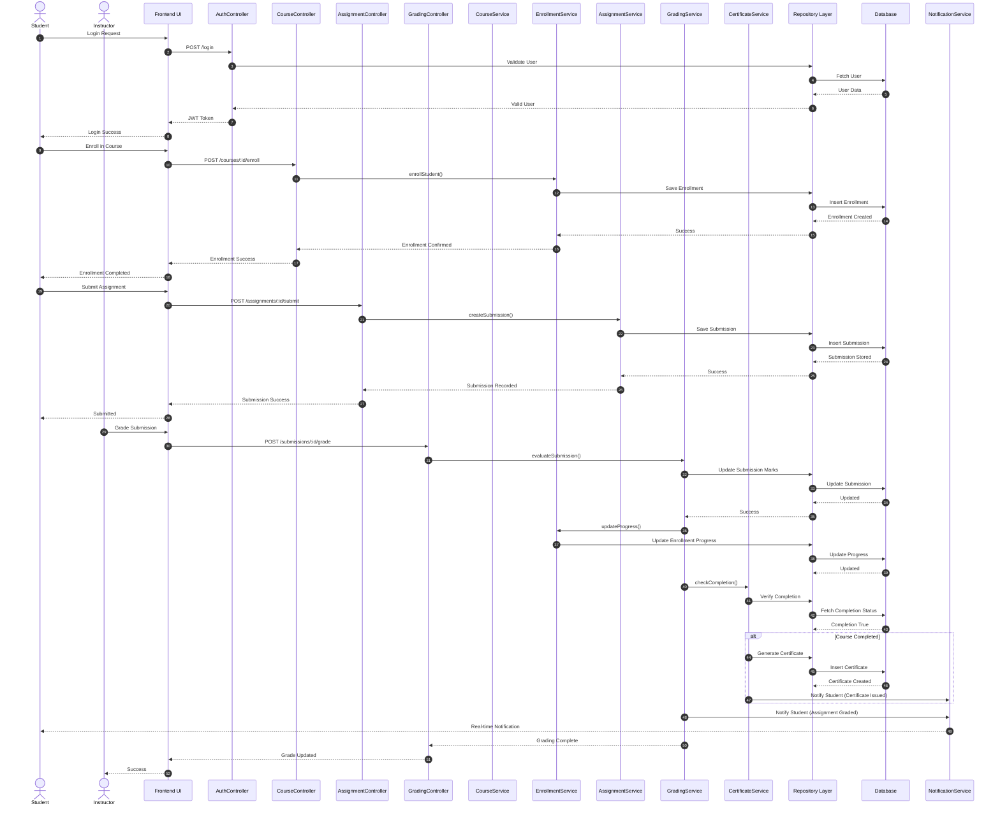

# Sequence Diagram — Learning Management System (LMS)

## Main Flow: Student Enrolls → Submits Assignment → Instructor Grades → Certificate Generated

This sequence diagram illustrates the complete lifecycle of a student interacting with the LMS system — from course enrollment to assignment submission, grading, progress update, and certificate generation.

The flow demonstrates interaction between:

- Student
- Instructor
- Frontend UI
- Controllers
- Services
- Repositories
- Database
- Notification System

---

## Sequence Diagram (Mermaid)

---

## Flow Summary

| Phase | Description | Key Patterns Used |
|-------|-------------|-------------------|
| **1. Authentication** | Student logs in via Frontend UI. Credentials are validated through Controller → Repository → Database. JWT token is issued upon successful authentication. | Repository Pattern, Layered Architecture |
| **2. Enrollment** | Student enrolls in a course. Request flows through CourseController → EnrollmentService → Repository → Database. Enrollment record is created and confirmed. | Repository Pattern, Service Layer |
| **3. Assignment Submission** | Student submits an assignment. Submission flows through AssignmentController → AssignmentService → Repository → Database. Submission is stored and acknowledged. | Repository Pattern, Service Layer |
| **4. Grading & Certification** | Instructor grades the submission. GradingService updates marks, triggers progress update via EnrollmentService, checks completion via CertificateService, and generates certificate if course is completed. Notifications are sent to the student. | Strategy Pattern, Observer Pattern, Composite Pattern |
