## Use Case Diagram

This diagram shows all major use cases for the LMS platform, organized by the three primary actors: **Student**, **Instructor**, and **Admin**.

```mermaid
graph LR

    %% Actors
    S(("🎓 Student"))
    I(("👨‍🏫 Instructor"))
    A(("🛡️ Admin"))

    %% Student Use Cases
    S --- UC1["Register"]
    S --- UC2["Login"]
    S --- UC3["Browse Courses"]
    S --- UC4["Enroll in Course"]
    S --- UC5["View Lessons"]
    S --- UC6["Submit Assignment"]
    S --- UC7["View Grades"]
    S --- UC8["Track Progress"]
    S --- UC9["Download Certificate"]

    %% Instructor Use Cases
    I --- UC2
    I --- UC10["Create Course"]
    I --- UC11["Edit Course"]
    I --- UC12["Publish Course"]
    I --- UC13["Add Module"]
    I --- UC14["Add Lesson"]
    I --- UC15["Create Assignment"]
    I --- UC16["Grade Submission"]
    I --- UC17["View Enrolled Students"]

    %% Admin Use Cases
    A --- UC2
    A --- UC18["Manage Users"]
    A --- UC19["Approve Courses"]
    A --- UC20["Monitor Platform"]

    %% Styling
    style S fill:#4FC3F7,stroke:#0288D1,color:#000
    style I fill:#81C784,stroke:#388E3C,color:#000
    style A fill:#FF8A65,stroke:#E64A19,color:#000
```

---

## Use Case Descriptions

| #    | Use Case              | Actors            | Description                                          |
|------|-----------------------|-------------------|------------------------------------------------------|
| UC1  | Register              | Student           | Create a new user account in the system.             |
| UC2  | Login                 | All Users         | Authenticate user using credentials.                 |
| UC3  | Browse Courses        | Student           | View available published courses.                    |
| UC4  | Enroll in Course      | Student           | Enroll into a selected course.                       |
| UC5  | View Lessons          | Student           | Access course modules and lessons.                   |
| UC6  | Submit Assignment     | Student           | Submit assignment for evaluation.                    |
| UC7  | View Grades           | Student           | View graded results.                                 |
| UC8  | Track Progress        | Student           | Monitor completion percentage.                       |
| UC9  | Download Certificate  | Student           | Download certificate after course completion.        |
| UC10 | Create Course         | Instructor        | Create a new course with metadata.                   |
| UC11 | Edit Course           | Instructor        | Modify existing course content.                      |
| UC12 | Publish Course        | Instructor        | Submit course for approval and publish.              |
| UC13 | Add Module            | Instructor        | Add a module to a course.                            |
| UC14 | Add Lesson            | Instructor        | Add a lesson under a module.                         |
| UC15 | Create Assignment     | Instructor        | Create an assignment for a course.                   |
| UC16 | Grade Submission      | Instructor        | Evaluate and grade student submission.               |
| UC17 | View Enrolled Students| Instructor        | View students enrolled in a course.                  |
| UC18 | Manage Users          | Admin             | Create, update, deactivate users.                    |
| UC19 | Approve Courses       | Admin             | Review and approve courses for publishing.           |
| UC20 | Monitor Platform      | Admin             | Monitor overall system activity and health.          |
